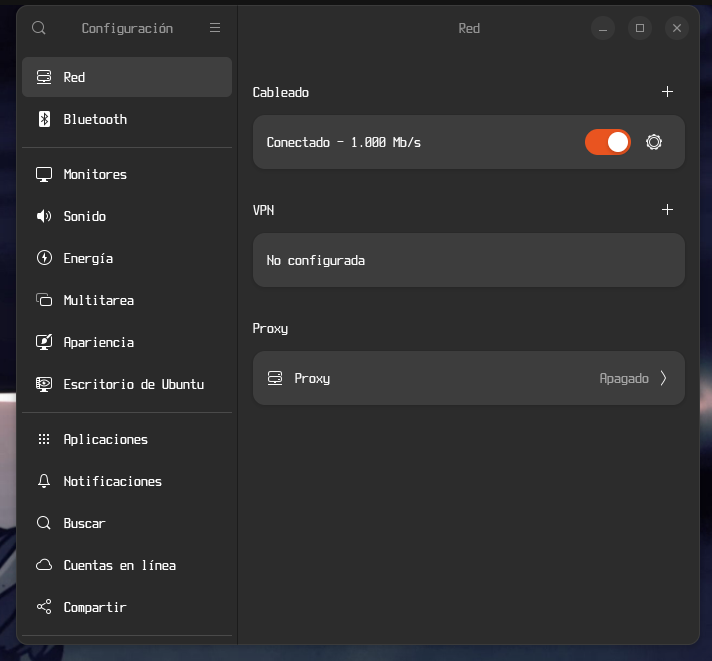
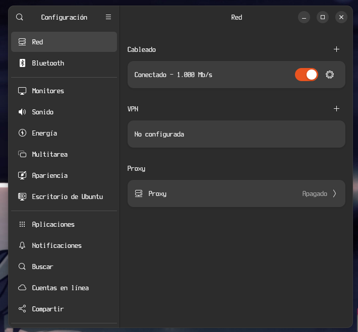
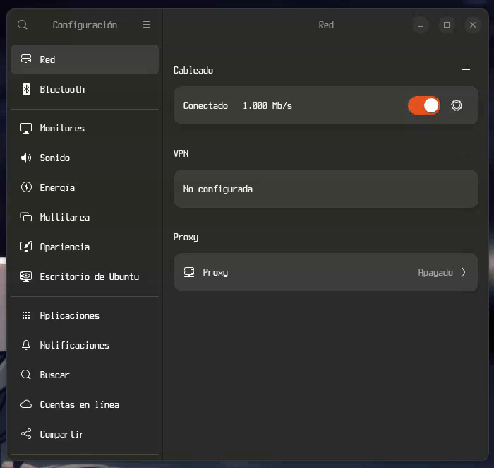
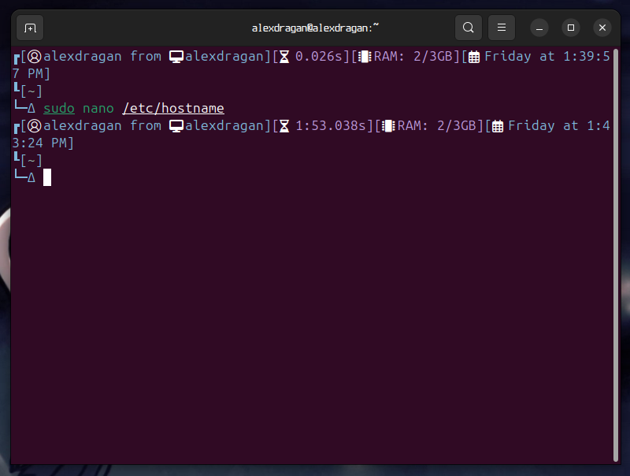
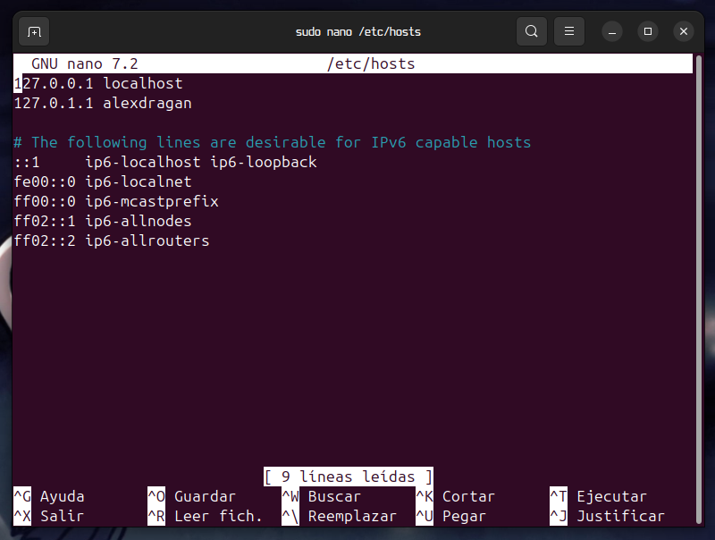

# Instalacion y configuracion

LDAP es un servidor que te permite gestionar diversos dispositivos mediante un dominio.

## Instalacion
Abrimos una terminal con ctrl ctrl + alt + t y ejecutamos el comando.
```
ip a
```

o en caso de tener instalado net-tools.
```
ifconfig
```

Pulsamos en el icono de red.


Pulsamos en la flecha al lado de cableado.


Pulsamos en configurar de red cableada.



Pulsamos en la tuerca.


Pulsar en IPV4


Pulsamos en manual


Asignamos la direccion del ip a o ifconfig, mascara de red, puerto de enalce y DNS


Pulsar en aplicar.



Desconectar el interruptor y volverlo a conectar. En caso de hacerlo en un server abria que modificar un archivo del /etc/netplan y ejecutar el comando ```sudo netplan apply```



Volvemos abrir el terminal editamos el archivo hostname


Guardamos los cambios del archivo.



Ahora tocara editar el archivo /etc/hosts.



en el 127.0.1.1 cambiamos el hostname antiguo al que hemos puesto tambien agregamos una nueva linea con la ip, dominio y hostname de la maquina.


Guardamos el archivo y reiniciamos la maquina.


Descargamos el archivo y lo extraemos.


